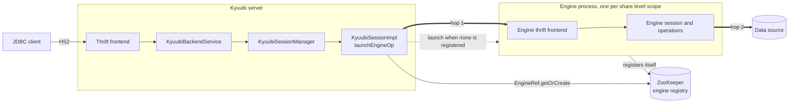
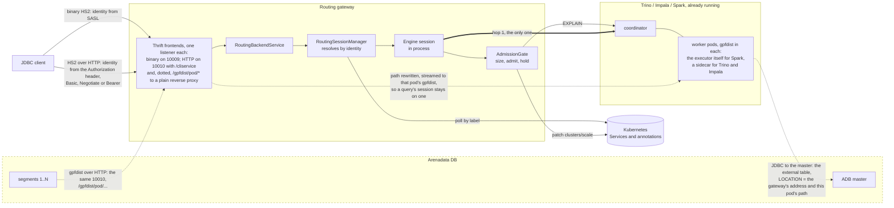

# Kyuubi Routing Gateway

A gateway that routes each session to an **already running** Trino cluster chosen
by the authenticated identity, instead of launching an engine process.

Composition is the whole design — see `RoutingGateway`:

```scala
override val backendService = new RoutingBackendService()   // routes by identity
override lazy val frontendServices = ...                    // stock Kyuubi frontends
```

Because no engine is launched, query results traverse one intermediary rather
than two. That matters when the gateway also carries bulk traffic.

## How it differs from the Kyuubi server

Same frontends, same session and operation layer, different everything in
between. The Kyuubi server finds or starts an engine and proxies to it; this
gateway resolves a cluster that already exists and talks to it directly.

**Kyuubi server**



**Routing gateway**, with the ADB Connector path dotted



The dotted overlay is the point of the gateway being the ADB Connector, and it
says something that is easy to get backwards: **the query and the data both
cross the gateway, through different doors, and the data never enters the
engine session.**

The control path runs the opposite way from what the name suggests. Nothing in
ADB speaks HS2, and the master never opens a connection outward. As in the ADB
Spark Connector, it is the connector side that opens JDBC to the master, and
in the order its write diagram shows: start the gpfdist server, then create
the external table that names it, then let the segments come. That side lives
in the pod - gpfdist is the executor itself for Spark with the ADB Spark
Connector, a sidecar for Trino and Impala, whose workers do not speak it - and
the only thing a pod does differently here is what it writes into `LOCATION`:
not its own address, which the segments could not reach, but the gateway's,
with a path that names this pod. The gateway opens no JDBC and creates no
tables. What arrives over HS2 is the query that set all this off, routed,
authenticated, admitted and sized like any other - one entry point for Trino,
Impala and Spark alike, which is what collapsing the connector and the
gateway into one service was for.

The data path is a different door of the same gateway. ADB moves bulk through
external tables over gpfdist, which is plain HTTP with the query's identity in
`X-GP-*` headers: every segment sends its own request to the gpfdist server
named in `LOCATION`, the server groups the requests of one query into a
session by transaction, command and scan number, and parcels its stream out to
those connections round-robin. The master takes no part in it. In the ADB
Spark Connector that server is every executor, and `LOCATION` lists one URI
per executor, so the segments are spread across them, at most
`gp_external_max_segs` per server.

A segment cannot connect to a pod, though - the segments live outside
Kubernetes, and a pod address is not routable from there. The Tanzu Greenplum
connector for Spark gets around it with an Ingress and a path per executor
added while the transfer runs. Here there is no Ingress: the gateway is the
one external address, so forwarding is its job, and forwarding is all of it.

Nor is there a door of its own for it. gpfdist is HTTP/1.1 - `GET` for a
readable table, `POST` for a writable one, `X-GP-*` headers and a chunked
body - and the gateway already listens for HTTP: the Thrift HTTP frontend is
a Jetty server with the HS2 servlet mounted on `/cliservice`, and HS2
authentication lives inside that servlet, not on the listener. All the
gateway adds is a second mapping on that listener, `/gpfdist/<pod>/*`, to a
plain reverse proxy - Jetty's own, `jetty-proxy` is already in the assembly -
which rewrites the path and streams, and knows nothing about gpfdist because
it needs to know nothing. `LOCATION` names the gateway, port 10010, with a
path per pod; a segment's request arriving on that path is streamed,
unbuffered, to the gpfdist in that pod, whose address the gateway resolves
through the same Kubernetes lookup routing uses. A path leads to one pod, so every request of a session lands on the
same gpfdist, which is what the session needs, whichever gateway replica the
Service handed the connection to. gpfdist being HTTP is what makes that
possible; a binary stream could not be told apart by path.

Two things follow. gpfdist has no authentication of its own - `gpfdists`,
its TLS form with client certificates from the segments, is all there is - so
the path is open unless the listener runs TLS and asks for a certificate,
which is no different from gpfdist anywhere else. And ADB needs the HTTP
frontend on: a Kerberos-only deployment, which turns it off, cannot be the
connector.

So the bulk does cross the gateway - which is why one hop matters, and why
the introduction says so - but as an HTTP proxy in its own process, never
through the engine session or the HS2 path: no rows are parsed, sized or held.
What the proxy has to do is what an ingress would have had to: stream without
buffering, since a gpfdist response is one long chunked stream per
connection, keep requests open as long as `readable_external_table_timeout`
on the ADB side allows, and carry the `X-GP-*` headers through untouched. Its
throughput is the gateway's network, and every replica adds to it, because
the Service spreads the segments' connections across replicas. Segments and
pods still exchange the data in parallel and in both directions - writable
external tables for reads out of ADB, readable ones for writes into it.

None of the dotted part exists in this module yet; the picture is where it
goes.

For an ordinary JDBC client the results cross the gateway too - that is the
single hop the thick arrow marks - but through the engine session. ADB's bulk
crosses it through the proxy, in parallel across segments, and is the only
traffic that does.

What the pictures are saying:

| | Kyuubi server | Routing gateway |
|---|---|---|
| Hops a result crosses | two - server, then engine | one |
| Where backends come from | ZooKeeper, written by the engines | Kubernetes Services, annotated by whoever owns the cluster |
| Engine processes | launched when none is registered | none, ever |
| What decides the backend | share level and engine type | the authenticated identity |
| Capacity | the engine's own | sized before admission, held in a ledger |
| Cluster size | fixed | grown for a query, given back when idle |
| Bulk transfer to ADB | not its concern | through it, as an HTTP proxy with a path per pod, in parallel |

The frontends and the engine session layer are shared, not reimplemented:
`TrinoSessionImpl` and `TrinoOperationManager` are the engine's own classes
running inside the gateway, which is what removes the second hop. The pieces
this module actually adds are the resolver, the gate and the scaler.

## Engines

| Engine | |
|---|---|
| `trino` | routing, admission, sizing from `EXPLAIN`, scaling both ways |
| `impala`, `spark` and the other JDBC dialects | routing and impersonation only |

`kyuubi.gateway.engine` takes `trino` or the name of any dialect on the
classpath - `clickhouse`, `doris`, `impala`, `mysql`, `oracle`, `phoenix`,
`postgresql`, `spark`, `starrocks`. Anything else is a startup error naming what
is supported, rather than a gateway that comes up and fails at the first
session.

### Spark

Kyuubi's own Spark support launches an engine and finds it through ZooKeeper -
`EngineRef.getOrCreate` looks one up at the configured share level and starts
one only when none is registered, so a long-running engine is reused rather
than started per session. This gateway removed that machinery along with the
rest of the engine layer, because its premise is a cluster that already exists
and should be one hop away rather than two.

What fits that premise is a **Spark Thrift Server**: already running, speaking
HS2, reachable with the Hive driver. `SparkDialect` makes it an ordinary
backend - discovered from a Service, routed to by identity, impersonated the
same way Impala is.

What it does not get is admission, sizing or scaling. Spark's own scheduler
decides what runs and with what; a second opinion from outside would fight it
rather than help. A cluster that needs those is a Trino one.

The dialect lives here rather than in `kyuubi-jdbc-engine` so the engine
everyone else uses is untouched - the service loader merges what it finds
across jars. It brings no connection provider: providers are keyed on the
driver rather than the engine, and the one shipped for Impala already handles
`KyuubiHiveDriver`, so a second claiming the same driver would make the choice
between them ambiguous.

## Routing

`RoutingSessionManager` resolves the cluster for the user and puts its address
into the session conf. `TrinoSessionImpl` reads the connection url from there,
so the Trino session and operation layer is reused unmodified.

Configuration keys are written in full in the Configuration table below and
shortened in prose, where `admission.holdTimeout` means
`kyuubi.gateway.admission.holdTimeout`.

Resolvers are selected with `kyuubi.gateway.cluster.resolver`:

* `static` — clusters declared in configuration, see `StaticClusterResolver`
* `kubernetes` — clusters discovered from core Services, see `KubernetesClusterResolver`

A user with no allowed cluster is rejected, never redirected to a default:
a routing mistake must not become an access control bypass.

## Capacity

Neither Trino nor Impala binds a query to a subset of workers - every query
spreads over every active node - so "reserve workers for this query" is not
expressible inside either. What is expressible is accounting, which is what `capacity/` does:
track what a cluster can hold, subtract what is already admitted, admit only
when the remainder covers it.

Memory is the tracked quantity because it is the one both engines enforce. CPU is
not: an estimate gives work, not power, so dividing it by capacity yields a
duration rather than a requirement.

Denials are three cases rather than a boolean, because they call for different
responses:

| Denial | Meaning | What helps |
|---|---|---|
| `Busy` | even the ceiling could not cover what is held plus what is asked | waiting |
| `NeedsScaleUp(n)` | growing to `n` workers, within the ceiling, would cover it | scaling to `n` |
| `TooLarge(n, max)` | beyond the ceiling on its own, before anything else is held | neither |

The gateway acts on the first two. `NeedsScaleUp(n)` fires whenever raising the
worker count to `n` would fit what is held plus this query - whether the
cluster is idle or other queries are already running on it, since a bigger
cluster makes room for a new query alongside what is in flight even though it
does not relieve that query's own memory. `Busy` is what is left once `n` would
exceed the ceiling itself: nothing to scale into, so the query holds until room
frees, up to `admission.holdTimeout`. `TooLarge` is answered at once - it is too
big on its own, before anything else is even considered, so waiting and scaling
are both futile and turning that answer into a timeout helps nobody.

Admitting against workers that do not exist yet is safe only because the worker
count travels with the query as `required_workers_count`: Trino holds it in
`WAITING_FOR_RESOURCES` until they register. A scale-up that never lands shows
as a query that waited and failed, rather than one that quietly ran on too few
workers.

Reservations are released when the operation closes. That covers the normal case
and not a client that vanishes mid-query or a gateway restarted while queries
were in flight - so each query also carries its reservation id to the cluster as
a client tag, and `reconcile.enabled` turns on a pass that compares the ledger
against the coordinator's own list of queries. An unreachable coordinator
changes nothing: an empty answer would justify releasing everything, and
over-admitting onto a cluster that is already struggling is worse than refusing
for a while.

With several replicas, `admission.shared` moves the ledger into a Secret per
cluster and admits by compare-and-swap on its `resourceVersion`. Without it each
replica admits against its own ledger and together they overcommit every
cluster. Deliberately not leader election: a leader would make every admission
wait for one replica and make its death an outage.

`AdmissionPolicy` picks how a cluster is shared. `PackByMemory` admits while
memory is left, which is safe for memory but not for time - co-resident queries
share CPU and both slow down. `Exclusive` runs one query at a time: predictable
duration, idle gaps.

## Sizing

`sizing/` reads `EXPLAIN (TYPE DISTRIBUTED, FORMAT JSON)`. The parser walks the
document for `estimates` arrays rather than following a path, because the
top-level shape differs between plan types and is not a stable contract across
Trino versions.

Trino writes an unestimatable value as the quoted string `"NaN"`, typically when
table statistics are missing. That reads as *unknown*, never as zero: sizing a
query as free would put an unbounded one on a minimal cluster and fail it on
memory.

Memory alone is not enough. Trino reports `memoryCost` 0 for a plan that only
streams - a scan holds nothing, and the planner says so truthfully - so sizing
on it alone reserves nothing for the commonest query shape there is, and a gate
that reserves nothing admits everything. `outputSizeInBytes` stands in where
`memoryCost` is silent: the larger of the two is a lower bound on the query's
footprint and is never zero for a query that produces rows.

`memoryFactor` is the calibration knob and its default is a guess. The planner's
per-operator estimates are not the query's peak - the peak lies between the
largest operator and the sum of the live ones.

The reconciler turns the guess into a measurement: for every query it sees
finish, it compares what was reserved against what the coordinator reports the
query actually held, and logs the factor that would have been right. Aggregated
rather than averaged per query, because what decides whether a cluster fits its
work is the total held against the total needed, and a per-query average lets a
crowd of small queries outvote the large ones. It reports and does not act.

## Configuration

| Key | Default | Meaning |
|---|---|---|
| `kyuubi.gateway.engine` | `trino` | engine this instance serves |
| `kyuubi.gateway.cluster.resolver` | `static` | `static` or `kubernetes` |
| `kyuubi.gateway.admission.enabled` | `false` | gate statements on capacity |
| `kyuubi.gateway.admission.policy` | `PackByMemory` | or `Exclusive` |
| `kyuubi.gateway.sizing.memoryFactor` | `1.5` | calibration, see above |
| `kyuubi.gateway.sizing.defaultWorkers` | `2` | used when no estimate exists |
| `kyuubi.gateway.kubernetes.labelSelector` | `kyuubi.gateway/enabled=true` | which Services are clusters |
| `kyuubi.gateway.kubernetes.namespace` | all | restrict the search |
| `kyuubi.gateway.kubernetes.pollInterval` | `10000` | ms between polls |
| `kyuubi.gateway.admission.holdTimeout` | `0` | ms to wait for a busy cluster before refusing |
| `kyuubi.gateway.admission.requiredWorkersMaxWait` | cluster's own | how long a query may wait for its workers |
| `kyuubi.gateway.admission.shared` | `false` | keep reservations in Secrets, for several replicas |
| `kyuubi.gateway.admission.sharedNamespace` | the gateway's own | where the ledgers live |
| `kyuubi.gateway.admission.sharedPollInterval` | `1000` | ms between checks while holding, when shared |
| `kyuubi.gateway.scaling.enabled` | `false` | let the gateway raise a cluster's worker count |
| `kyuubi.gateway.scaling.shrink.enabled` | `false` | let it give workers back when a cluster is idle |
| `kyuubi.gateway.scaling.shrink.idleAfter` | `600000` | ms with nothing reserved before a worker goes |
| `kyuubi.gateway.scaling.shrink.interval` | `60000` | ms between passes |
| `kyuubi.gateway.scaling.shrink.drainTimeout` | `300000` | ms a worker is given to finish its tasks |
| `kyuubi.gateway.kubernetes.scale.group` | `trino.arenadata.io` | CRD group holding the worker count |
| `kyuubi.gateway.kubernetes.scale.version` | `v1alpha1` | CRD version |
| `kyuubi.gateway.kubernetes.scale.plural` | `clusters` | CRD plural |
| `kyuubi.gateway.reconcile.enabled` | `false` | reclaim reservations from the cluster's own view |
| `kyuubi.gateway.reconcile.interval` | `30000` | ms between reconciliation passes |
| `kyuubi.gateway.reconcile.grace` | `60000` | ms before a reservation is judged missing |
| `kyuubi.gateway.reconcile.user` | the process user | identity used to read `/v1/query` |
| `kyuubi.gateway.jdbc.impersonationTemplate` | `;hive.server2.proxy.user={user}` | how the JDBC cluster is told who is asking |

Admission is off by default. Routing is useful on its own, and admission changes
what clients see - a query that used to run can now be refused - so turning it
on should be a decision rather than something that arrives with an upgrade.

Clusters are declared by annotations on their coordinator `Service`:

```yaml
kyuubi.gateway/engine: trino
kyuubi.gateway/users: alice,bob
kyuubi.gateway/default: "false"
kyuubi.gateway/max-memory-per-node-bytes: "10737418240"
kyuubi.gateway/workers: "4"
kyuubi.gateway/max-workers: "10"
kyuubi.gateway/scale-target: trino-analytics
```

`scale-target` names the custom resource whose `scale` subresource stands for
this cluster's size. It is an annotation rather than something derived from an owner
reference on purpose: the gateway is told what it may scale, so a Service it
happens to reach cannot hand it write access to an object nobody meant to
expose. Without it a cluster is never scaled, only admitted to.

Anything under `kyuubi.gateway.cluster.<name>.session.` becomes session
configuration for that cluster, with the prefix stripped - this is how a cluster
carries its own catalog, timeouts or Trino session properties:

```properties
kyuubi.gateway.cluster.analytics.url = http://trino-analytics:8080
kyuubi.gateway.cluster.analytics.users = alice,bob
kyuubi.gateway.cluster.analytics.session.kyuubi.session.engine.trino.connection.catalog = hive
```

Note the key inside: Trino's connection settings are `kyuubi.session.engine.
trino.connection.*`, not `kyuubi.engine.trino.connection.*`. The wrong spelling
is accepted silently and the session then fails to open with "Trino default
catalog can not be null!".

`kyuubi.session.user` is set from the authenticated caller and cannot be
overridden by a cluster declaration - see below.

Capacity is only used when all three of its annotations are present and
consistent. A partial declaration is worse than none: the accountant would size
against a made-up ceiling. A cluster that declares no capacity is admitted
unaccounted, with a warning - refusing would break every cluster not yet
annotated.

## Known limits

* Fair queueing is not implemented. Held queries are unordered, so a large one
  can be passed by smaller ones that keep fitting. Ordering them would mean
  holding capacity empty while the big query waits, which idles the cluster for
  as long as the query is large.
* Shrinking needs the workers to be a StatefulSet. A Deployment does not let the
  departing pod be named - `pod-deletion-cost` only biases the choice, and the
  specification calls that best-effort - so draining one pod could be followed
  by Kubernetes removing another, taking its queries with it.
* Scaling needs the `Cluster` CRD to declare `subresource:scale`. Without it
  the subresource does not exist and every scale-up fails, which shows as
  queries refused with `NeedsScaleUp`.
* One gateway instance serves one engine - see `RoutingSessionManager` for why
  the interfaces make a single instance serving both impractical.
* The JDBC path is ungated. Impala runs its own admission control, so
  double-accounting it needs thought rather than a copy of the Trino branch.
* Parts of the Trino engine read process-wide configuration where a gateway
  would want per-session: `SESSION_PROGRESS_ENABLE`,
  `ENGINE_TRINO_OPERATION_INCREMENTAL_COLLECT` and
  `ENGINE_OPERATION_CONVERT_CATALOG_DATABASE_ENABLED` come from
  `sessionManager.getConf`. Setting them per cluster has no effect; set them
  once for the gateway. The connection details, which matter most, were fixed
  to read per session.
* `memoryFactor` is reported, never applied. The reconciler measures what
  queries actually used against what was reserved for them and logs the factor
  that would have been right; setting it stays a decision. A factor that moved
  on its own would change admission without anyone deciding to, and the first
  sign of a bad measurement would be queries being refused.

## Tests

The ordinary build runs unit tests only:

```bash
mvn -pl kyuubi-routing-gateway test
```

Three suites start a real Trino in a container and drive the gateway through
it. They are tagged `ContainerTest` and excluded by default, because they need a
Docker socket the build is deliberately not given - and a build that fails for
want of a socket teaches people to ignore failures.

```bash
mvn -pl kyuubi-routing-gateway test \
    -Dmaven.plugin.scalatest.exclude.tags=org.scalatest.tags.Slow \
    -Dsuites='org.apache.kyuubi.gateway.it.GatewayTrinoBinarySuite'
```

| Suite | |
|---|---|
| `GatewayTrinoBinarySuite` | the Trino engine's own query suite, over binary HS2 |
| `GatewayTrinoHttpSuite` | the same, over the HTTP transport |
| `GatewayAdmissionSuite` | sizing and admission against a real planner |

The first two reuse `TrinoQueryTests` from `externals/kyuubi-trino-engine`
unchanged, and that is the
point: the gateway's claim is that routing changes where a query goes and
nothing about what it returns, so the suite that already decides what Trino
behaviour means is the one to hold it to. Both transports are run because they
are different code paths with different framing.

`GatewayAdmissionSuite` is the only thing that can say whether `EXPLAIN` on a
real query yields a plan with estimates in it. A hand-written plan proves the
parser and nothing about the plans.

## Permissions

Everything the gateway reads or writes in Kubernetes is optional, so grant only
what is switched on:

| Feature | Resource | Verbs |
|---|---|---|
| `kubernetes` resolver | `services` | `get`, `list` |
| `scaling.enabled` | `clusters.trino.arenadata.io/scale` | `get`, `update` |
| `admission.shared` | `secrets` in the ledger namespace | `get`, `list`, `create`, `update`, `delete` |

`reconcile.enabled` needs no Kubernetes rights - it talks to the coordinator's
own `/v1/query` as `reconcile.user`, which a cluster with authentication
enabled has to permit separately.

## Running

For Kubernetes see [`deploy/README.md`](../deploy/README.md), which covers the
manifests, the image build, permissions and the configuration in one place.
Directly:

```bash
java -cp "kyuubi-routing-gateway/target/classes:$(cat kyuubi-routing-gateway/target/cp.txt)" \
  org.apache.kyuubi.gateway.RoutingGateway \
  --conf kyuubi.frontend.protocols=THRIFT_BINARY \
  --conf kyuubi.frontend.thrift.binary.bind.port=10099 \
  --conf kyuubi.gateway.cluster.analytics.url=http://trino-analytics:8080 \
  --conf kyuubi.gateway.cluster.analytics.users=alice
```

Generate `cp.txt` once with
`mvn -pl kyuubi-routing-gateway dependency:build-classpath -Dmdep.outputFile=target/cp.txt -Dmdep.includeScope=runtime`.

`bin/kyuubi` starts `KyuubiServer` and is not the launcher for this module.

A protocol in `kyuubi.frontend.protocols` that the gateway does not implement is
a startup error, not a warning: a gateway that came up listening on nothing
would look healthy to a supervisor while serving no one.

## Building

No JDK is needed on the host; the build runs in a container. A warm `~/.m2`
makes repeat builds fast, so mount it rather than a throwaway volume.

```bash
docker run --rm -u "$(id -u):$(id -g)" \
  -e HOME=/var/maven -e MAVEN_CONFIG=/var/maven/.m2 \
  -v "$HOME/.kyuubi-build-home:/var/maven" \
  -v "$HOME/.m2:/var/maven/.m2" \
  -v "$PWD:/src" -w /src \
  maven:3.9-eclipse-temurin-17 \
  mvn -B -Duser.home=/var/maven -pl kyuubi-routing-gateway test
```

Four things that are easy to get wrong:

* `/var/maven` must be a writable mount, not just `/var/maven/.m2` — the Scala
  plugin writes its zinc cache to `$HOME/.sbt`.
* `MAVEN_CONFIG` and `-Duser.home` are both required when running non-root,
  otherwise `settings.xml` is ignored and nothing is cached on the host.
* The root pom points Maven Central at a GCS Asia mirror that measured ~1.9 MB/s
  here against ~7.2 MB/s from repo1. A `<mirror>` for `central,gcs-maven-central-mirror`
  in `~/.m2/settings.xml` fixes it. Do not use `mirrorOf=*` — the Arenadata
  repositories are not a Central mirror and hold different artifacts.
* The first build needs `-am install` to populate dependencies. Add
  `-DskipTests -Dmaven.test.skip=true -Dspark.archive.download.skip=true
  -Dflink.archive.download.skip=true -Dhive.archive.download.skip=true`:
  the external archives are ~1 GB and unrelated to this module, and
  `kyuubi-server` test sources do not compile without the Spark distribution.
